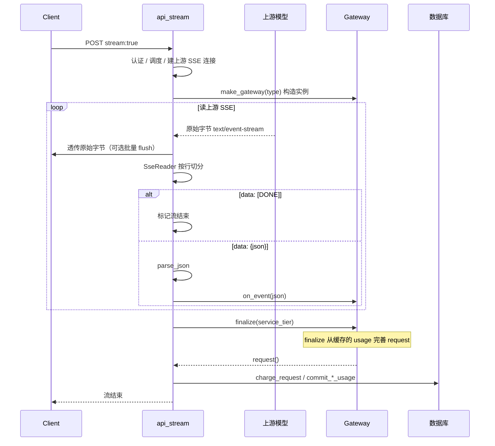

# proxy_response Gateway 流式计费设计

本页描述 `proxy_response::Gateway` 体系的**目标流程**。与当前线上仍走 `relay.cpp` 通用泵送的路径是两套设计；后续接入时以本页为准。

## 目标

- **api_stream** 负责：HTTP/SSE I/O、按行切 `data:`、JSON 解析、创建 Gateway、流结束后扣费。
- **Gateway** 负责：按 API 类型理解 JSON 语义，在 `finalize` 时产出完整 `Request`。
- **relay** 中的 `SseReader` / `merge_sse_event_json` 可被 api_stream 侧逻辑替代，Gateway 不再关心 SSE 字节格式。

## 模块边界

| 模块 | 路径 | 职责 |
| --- | --- | --- |
| 路由入口 | `backend/src/server/http_dispatch.cpp` | `api_stream` 注册 `/v1/*`；判断 `stream: true` |
| 连接与调度 | `backend/src/proxy_request/gateway.cpp` 等 | 认证、选渠道、建立上游 SSE 连接 |
| 流 I/O + 解析 | **api_stream 层（待接入）** | 读上游字节、剥 `data:`、解析 JSON、转发客户端 |
| 计费解析 | `backend/include/proxy_response/gateway.hpp` | 基类；子类按 API 填 `Request` |
| Chat 实现 | `backend/include/proxy_response/openai_chat.hpp` | `OpenaiChatCompletion` |
| 扣费 | `relay.cpp` 中 `charge_request` / `commit_*_usage` | 流结束后写 `usage_events`、扣余额 |

注意：`proxy_request/gateway.cpp`（HTTP 代理调度）与 `proxy_response/gateway.hpp`（响应计费解析）是不同模块，勿混名。

## 端到端流程



## api_stream 层步骤（待实现）

### 1. 收到请求

- 入口：`http_dispatch.cpp` 中 `api_stream` 注册的 handler（如 `/v1/chat/completions`）。
- 条件：请求 JSON 中 `"stream": true`。
- 前置：完成 token 认证、渠道调度、上游流式连接（与现 `run_chat_completions_stream` 前半段相同）。

### 2. 创建 Gateway

按 API / 渠道类型构造子类实例，**每个流一个对象**：

```cpp
std::unique_ptr<Gateway> gw = std::make_unique<OpenaiChatCompletion>(
    billing_model,
  tier_multiplier,      // 构造时可先默认 1.0；最终以 finalize 为准
    channel_multiplier);
```

| 类型 | 实现类 | 状态 |
| --- | --- | --- |
| OpenAI Chat Completions | `OpenaiChatCompletion` | 已写 |
| OpenAI Responses | 待写 | — |
| Anthropic Messages | 待写 | — |

工厂函数建议：`std::unique_ptr<Gateway> make_gateway(int channel_type, const Model &, double channel_multiplier);`

### 3. 读取并解析 SSE

api_stream **自己读**上游连接（或复用 `SseReader`，但不走 `merge_sse_event_json`）：

1. 增量读字节 → **原样写给客户端**（透传）。
2. 同一份字节喂给 `SseReader::consume`，得到 `SseEvent` 列表。
3. 对每个事件：
   - `event.done == true`（`data: [DONE]`）→ api_stream 自行标记结束，不调 Gateway。
   - 否则对 `event.data` 做 `parse_json` → 调 `gw->on_event(json)`。
4. 解析失败：记日志 / 标记上游错误；是否断流由 api_stream 策略决定。

**api_stream 做**：删 `data:` 前缀、按行组事件、JSON 解析。  
**Gateway 不做**：不接触 `text/event-stream` 原始文本。

### 4. Gateway 事件处理

#### `on_event(json)`

- **时机**：每个 SSE 事件一次（`[DONE]` 由 api_stream 识别，不必传入 Gateway）。
- **Chat Completions 典型行为**：
  - 普通 delta chunk（无 `usage`）：跳过。
  - 含 `usage` 的 chunk：缓存为 `last_usage_chunk_`（覆盖写入，保留最后一个）。

#### `finalize(service_tier)`

- **时机**：上游 EOF 或 `[DONE]` 之后、扣费之前，**只调一次**。
- **参数**：`service_tier` 来自**客户端请求 JSON**（`requested_service_tier`），不是 SSE 内容；Chat Completions 的 SSE 里通常没有 tier 字段。
- **职责**：
  1. 从 `on_event` 缓存的最后一个 usage chunk 填充 `Request` token 字段。
  2. 用 `tier_multiplier_for(model, service_tier, service_tier, input_tokens)` 重算 `request.tier_multiplier`（依赖最终 `input_tokens`）。

`OpenaiChatCompletion::finalize` 当前 token 语义：

```
input_tokens      = prompt_tokens - cached_tokens
output_tokens     = completion_tokens
cache_read_tokens = cached_tokens   // 来自 prompt_tokens_details（可选）
```

### 5. 扣费

流结束后 api_stream 从 Gateway 取出 `request`，调用现有计费链路：

```cpp
gw->finalize(requested_service_tier);
const Request &req = gw->request();
// fill UsageCommitPayload
charge_request(conn, req, payload);
// 或 commit_chat_usage(config, selection, payload, &req);
```

非流式路径可在 `finalize` 复用同一套 token 映射逻辑，本设计先聚焦 SSE。

## Gateway 基类接口

```cpp
class Gateway {
  public:
    Gateway(const Model &model, double tier_multiplier, double channel_multiplier);

    // 每个 SSE 事件（已解析为 JSON）
    virtual void on_event(boost::json::object &json) = 0;

    // 流结束：从缓存的 usage 完善 request
    virtual void finalize(std::string_view service_tier) = 0;

    const Request &request() const { return request; }

  protected:
    Request request;
};
```

说明：

- 构造时传入 `Model` 与 `channel_multiplier`；`tier_multiplier` 在 `finalize` 重算。
- `on_event` / `finalize` 由子类实现；api_stream 只调这两个方法。

## OpenAI Chat Completions 事件约定

| 阶段 | SSE `data:` 内容 | Gateway 动作 |
| --- | --- | --- |
| 中间 | `choices[].delta.content` | `on_event`：可忽略或缓存 `model` |
| 末尾 | `choices:[]` + `usage` | `on_event`：缓存 `last_usage_chunk_` |
| 结束 | `data: [DONE]` | api_stream 识别，不调 Gateway |
| 扣费前 | — | `finalize` → 读缓存 → 算 tier |

usage chunk 示例：

```json
{
  "object": "chat.completion.chunk",
  "model": "gpt-4o",
  "choices": [],
  "usage": {
    "prompt_tokens": 1200,
    "completion_tokens": 85,
    "total_tokens": 1285,
    "prompt_tokens_details": {
      "cached_tokens": 1024
    }
  }
}
```

需 `stream_options.include_usage: true` 才会有 usage chunk；否则流中无 usage，扣费需另定策略。

## 与现网 relay 路径的差异

| 项 | 现网 `relay.cpp` | 本设计 |
| --- | --- | --- |
| 读流 | `pump_sse_stream_reader_writer` | api_stream 读 |
| 解析 | `merge_sse_event_json` 全 API 通用 max 合并 | 分类型 Gateway |
| usage | `apply_pump_to_request` | `on_event` 缓存 + `finalize` |
| tier | `apply_pump_to_request` 末尾算 | `finalize` 末尾算 |
| 透传 | pump 内同步 | api_stream 内同步 |

迁移时：可先只替换 Chat Completions 路径，Responses / Messages 仍走 relay。

## 待办（接入清单）

- [ ] api_stream 层抽取：读上游 + `SseReader` + 调 Gateway（替代 `apply_upstream_passthrough_stream` 的计费侧）
- [ ] `make_gateway` 工厂
- [x] `OpenaiChatCompletion::on_event` 缓存最后一个含 `usage` 的 chunk
- [x] `OpenaiChatCompletion::finalize` 从缓存填 token（`prompt_tokens_details` 可选）
- [ ] `finalize` 内 `tier_multiplier_for`
- [ ] Responses / Anthropic 子类

## 相关文件

- `backend/include/proxy_response/gateway.hpp` — 基类
- `backend/include/proxy_response/openai_chat.hpp` — Chat 实现
- `backend/include/proxy_response/relay.hpp` — 现网 SSE 泵送（迁移前）
- `backend/src/server/http_dispatch.cpp` — `api_stream` 路由入口
- `backend/src/proxy_request/gateway.cpp` — `run_chat_completions_stream` 现网业务入口
